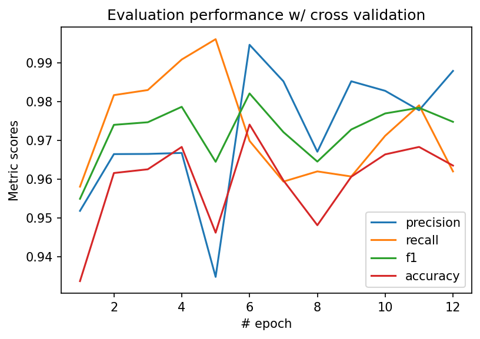

# CS 7641 Course Project

> Project Group 14: Amandeep Singh, Rajan V Tayal, Sai Shanbhag, Siddharth Sen, Yinghao Li

## Proposal

### Introduction
<p align="justify">
Pneumonia is an infection of one or both lungs in which the air sacs fill with pus and other liquid, and it is caused by bacteria, viruses, or fungi. Each year, pneumonia affects 450 million people globally and results in about 4 million deaths. Diagnosis is often based on symptoms and physical examination, and a Chest X-ray is a screening technique, which may help confirm the diagnosis.</p>
<p align="center">

</p>
<p align = "center">
<font size="1">Illustrative Example of Chest X-Ray in Patients with No pneumonia, Bacterial Pneumonia and Viral Pneumonia</font>
</p>
<p align="justify">
A qualified doctor then examines the X-ray for the signs of Pneumonia. Due to the subjectivity and manual bias of interpretations, the test results are not widely comparable. The current need is to establish a simple, automated, and objective screening technique that can adapt to a range of health and social service settings and would enable early detection of Pneumonia.</p>

### Problem Definition
<p align="justify">
The problem statement is to build a machine learning algorithm that accurately predicts whether the patient has No pneumonia, Bacterial Pneumonia, or Viral Pneumonia, based on their Chest X-ray.</p>

### Methods

#### Supervised Learning

<p align="justify">
<!-- Supervised image classification is a fundamental and well-studied problem in the computer vision (CV) area. -->
<!-- The accuracy of recent models facilitates the wild-usage of image classification and image segmentation techniques in the real world. -->
<!-- In the pre-deep neural network (DNN) era, machine learning techniques such as decision tree or support vector machine (SVM). -->
With the development of computational power and mathematic algorithms, convolutional neural networks (CNN Cun et al. 1990) became the principal method to address supervised image classification.
Based on CNN, Deep CNN (DCNN Krizhevsky et al. 2012), Inception (Szegedy et al. 2015), deep residual network (ResNet He et al. 2016) or pre-trained models such as ImageBERT (Qi et al. 2020) keep pushing forward the frontier.</p>
<p align="justify">
We plan to implement a DCNN for this project. The guideline is to balance the model performance and complexity, including the time spent in implementing the model as well as the time for training the model and fine-tuning its hyper-parameters. The starting point is to follow Krizhevsky et al. 2020's work. We will consider adding residual connections to improve the model performance.</p>


#### Unsupervised Learning
<p align="justify">
Unsupervised learning is promising in the medical imaging field as it lacks the bias which is implicit in supervised learning (Raza, Khalid, and Nripendra 2021). Kernel Principal Component Analysis (PCA) has been used to successfully extract respiratory signal estimation from X-ray images (Fischer, Peter, et al. 2017). Another method is to apply Deep CNNs and use clustering algorithms on extracted features to group similar pictures (Cohn, Ryan, and Holm 2021). </p>
<p align="justify">
Our approach will involve reducing the dimensionality of the dataset, initially with PCA. Subsequent methods may attempt to utilize pre-trained image classifiers such as vgg16, AlexNet, or NiftyNet (Gibson, Eli, et al.). Finally, we will use a clustering algorithm such as k-means to group similar items together.</p>


### Potentials Results

The multi-label classification model shall have the following three label categories:

<ul>
<li>Normal (No pneumonia)</li>
<li>Bacterial Pneumonia</li>
<li>Viral Pneumonia</li>
</ul>

<p align="justify">
Using the features extracted from the images, we shall use PCA to reduce dimensionality and visualize the data, and then use unsupervised learning to potentially identify 3 distinct clusters in our data (corresponding to our labels).</p>
<p align="justify">
Next, we shall measure the performance of each of our supervised classification models using suitable metrics such as accuracy, precision, recall, AUC etc. to compare the models and conclusively identify the algorithm that works best for our classification task.</p>

### Proposed Timeline and Responsibilities
<p align="justify">
For the Midterm, we expect to be done with a baseline model that incorporates both supervised and unsupervised learning. Moving onwards to the Endterm, we'll spend our time comparing models and fine-tuning the selected model.<br>
For this proposal, all team members have contributed a similar amount of effort into researching related literature and drafting the different sections of the document.  Moving forward, we are going to distribute the work among the group – tentatively, 3 members (Amandeep, Siddharth, Yinghao) are going to work on the supervised learning aspect, while 2 members (Sai and Rajan) are going to primarily focus on the unsupervised learning aspect of the project. Task delegation is flexible and will be adjusted as needed; deliverables between the two groups will be communicated clearly to ensure the best possible result.</p>


## Midterm

### Methods

#### Unsupervised Approach: Principal Component Analysis
<p align="justify">
For the unsupervised method, the goal was to utilize principal component analysis (PCA) for dimension reduction. Images can be represented as 2 dimensional matrices of intensityes (for grayscale images), and therefore a single image can be represented as a linearized vector of it's pixel values. Storing thousands of such feature vectors for whole images in memory is infeasible, as each image consists of thousands of pixels. We use PCA to reduce the dimensionality of this dataset, making the process of loading and learning from these images tractable. This will allow us to dramatically speed up our approach while also preserving much of the information for our unsupervsed algorithm. 
</p>
<p align="justify">
A challenge we encountered was that the dataset of x-ray images were of various sizes. So the first step was to resize, convert to grayscale, and normalize all the input images. This was achieved via PyTorch's transforms operations:
</p>

```
T = transforms.Compose([transforms.Grayscale(num_output_channels=1),
                        transforms.ToTensor(),
                        transforms.Resize(size),
                        transforms.Normalize(0.5, 0.5)])
```

<p align="justify">
The next step was to convert these images to  before applying PCA. Once that was done, we decided to retain the first 100 principal components which captured 86.59% of the variance. Given the volume of images we were working with, this decision made sense as it had an optimal balance between size and explained variance.
</p>

#### Unsupervised Approach: k-Means
<p align="justify">
As a first pass, we converted the output variable to be binary (as 'Pneumonia' or 'Normal') instead of using all three labels. Then we took the first 100 principal components obtained after applying PCA on the given training dataset and applied a k-means clustering with number of clusters, . The idea here is to roughly look for two different clusters pertaining to pneumonia or normal, corresponding to our PCA transformed dataset. 
</p>
<p align="justify">
We compared our k-means output to the actual labels to get an accuracy score, to indicate clustering performance. But since we do not know which label 0 or 1 pertains to (normal or pneumonia) we compared accuracy for both permutations and took the highest accuracy score. 
</p>

#### Supervised Approach: Deep Convolutional Neural Network with Residual Connection

<p align="justify">
For the supervised method, we currently target the binary image classification task: has pneumonia or not.
To address this issue, we use a deep convolutional neural network (DCNN) with the residual connection that alleviates the gradient vanishing problem.
The model contains nine convolutional layers, which are put into three groups.
</p>
<p align="justify">
The first layer of each group doubles the number of the channels of the convolutional kernel, which is maintained by the following two layers.
A residual connection links the input and output of those two layers with addition operation.
One exception is the very first convolutional layer, which takes the one-channel input and produces a 32-channel output.
At the end of each group, we adopt a max polling layer with kernel size  and stride  to reduce the image resolution by half.
</p>
<p align="justify">
The output of the convolutional groups is flattened and followed by three fully connected layers.
The output of the last fully connected layer is -dimensional, which matches the number of classes.
In addition, we use a dropout ratio  and ReLU activation function throughout the model.
</p>
<p align="justify">
All images are converted to  pixels with  luminance channel before being fed into the model.
However, this number may change in later improvements.
A -fold cross-validation is used to realize early stopping.
</p>

### Results

#### Unsupervised Approach: PCA
We selected the first three principal components from the PCA transformed data to visualize our dataset, as follows:

<p align="center">
  
</p>

The blue datapoints indicate 'Pneumonia' whereas the orange ones indicate 'Normal'.

#### Unsupervised Approach: k-Means
We achieved an accuracy score of , with the following confusion matrix.
<p align="center">
  
</p>
<p align="justify">
From the confusion matrix, we can see that the clustering model is performing moderately well in categorizing the pneumonia images correctly. However, it categorizes most of the normal ones as pneumonia as well, indicating that precision is lower than the recall. 
</p>
<p align="justify">
Given the nature of the problem, it is generally beneficial to have a higher recall score, since we would be more inclined to avoid False Negatives while detecting pneumonia instead of minimizing False Positives, however, the magnitude of False Positives is too high in this case for it to be an acceptable model. 
It would thus make more sense for us to go for a supervised approach for better model performance.
</p>

#### Supervised Approach
<p align="justify">
The model is trained with mini-batch gradient descent, Adam optimizer and linear learning rate scheduler with  warmup ratio.
We use F1 score as the early stopping reference metric.<br />
Within  training epochs, the best F1 score the model achieves on the validation/training set is .
Other metrics of the best model are  precision,  recall and  accuracy.<br /> 
On the test set, the metrics are: accuracy: ; precision: ; recall: ;  f1: .
These results indicate severe over-fitting, which we will try to resolve in the following research.
</p>

#### Supervised Classification : Using PCA components 

<p align="justify">
We used the first 100 principal components to build supervised classification models in order to classify the images as ‘normal’ or ‘pneumonia’. Reducing the number of features in the flattened image (400 x 400) from 1,60,000 to 100 with PCA will help reduce overfitting on our training dataset of 4172 images.
</p>
<p align="justify">
Support Vector Classifier, Random Forest Classifier and Logistic Regression were the models which we tested on our training dataset which had dimensions of 4172 x 100. A grid search based 5-fold cross validation routine was used to fine-tune the hyperparameters of these models. Model performance metrics on test dataset are shown in the table below :  
<table>
<tbody>
<tr>
<td>Model</td>
<td>Precision</td>
<td>Recall</td>
<td>Accuracy Score</td>
</tr>
<tr>
<td>SVM</td>
<td>0.9690</td>
<td>0.9728</td>
<td>0.9568</td>
</tr>
<tr>
<td>RF</td>
<td>0.9845</td>
<td>0.9305</td>
<td>0.9339</td>
</tr>
<tr>
<td>Logistic</td>
<td>0.9690</td>
<td>0.9728</td>
<td>0.9568</td>
</tr>
</tbody>
</table>

  
</p>
<p align="justify">
From the table above, we can see that Logistic Regression and Support Vector classifier outperform Random forest classifier in recall and accuracy score metrics. As a next step, we will re-train these models on features obtained via t-sne; another dimensionality reduction technique to select the best feature reduction method for our dataset. We also plan to develop a web based interactive framework to deploy our trained models and classify new incoming images as normal or viral.
</p>

### Conclusion

With the recent COVID-19 outbreak, we have seen a rise in the number of cases of pneumonia observed in adults, especially senior citizens and those who have prior medical conditions. In times like these, developing a pneumonia detection model with quick and accurate results has been extremely gratifying experience as it allowed us to contribute in fight against the pandemic in our own small way. 

Throughout the modelling process, we used a combination of supervised and unsupervised approaches in order to come up with the best classification model for the analysis. We used PCA to transform and visualize the data following which we tried to use clustering to identify distinct clusters for normal and pneumonia x-rays. Following this, we used multiple 
supervised learning approaches including support vector machines, random forest and logistic regression. However, as we had hypothesized, the best model for an image classification task such as this turned out to be the Deep Convolutional Neural Networks (DCNN) model, which is the final model that we ended up using.

The project was a great collaborative experience as it allowed us to work together in a team. We were able to directly apply what we have learnt in class while at the same time see the results of different methods that we decided to use. Working on implementing the code for our models first hand was an enriching experience, as it gave us a flavour of how to build and develop code in a collaborative manner while at the same time converting the theory material learnt from class and implementing them in practice. We also got some exposure into a typical machine learning project pipeline that is used in the industry. Working on this project in a collaborative manner as a team was an extremely educational experience and we are grateful for being given the opportunity to do so.

## Final

### Methods

#### Unsupervised Approach: Principal Component Analysis
<p align="justify">
For the unsupervised method, the goal was to utilize principal component analysis (PCA) for dimension reduction. Images can be represented as 2 dimensional matrices of intensities (for grayscale images), and therefore a single image can be represented as a linearized vector of it's pixel values. Storing thousands of such feature vectors for whole images in memory is infeasible, as each image consists of thousands of pixels. We use PCA to reduce the dimensionality of this dataset, making the process of loading and learning from these images tractable. This will allow us to dramatically speed up our approach while also preserving much of the information for our unsupervised algorithm. 
</p>
<p align="justify">
A challenge we encountered was that the dataset of x-ray images were of various sizes. So the first step was to resize, convert to grayscale, and normalize all the input images. This was achieved via PyTorch's transforms operations:
</p>

```
T = transforms.Compose([transforms.Grayscale(num_output_channels=1),
                        transforms.ToTensor(),
                        transforms.Resize(size),
                        transforms.Normalize(0.5, 0.5)])
```

<p align="justify">
The next step was to convert these images to  before applying PCA. Once that was done, we decided to retain the first 100 principal components which captured 85.99% of the variance. Given the volume of images we were working with, this decision made sense as it had an optimal balance between size and explained variance.
</p>

#### Unsupervised Approach: K-Means
<p align="justify">
As a first pass, we converted the output variable to be binary (as 'Pneumonia' or 'Normal') instead of using all three labels. Then we took the first 100 principal components obtained after applying PCA on the given training dataset and applied a k-means clustering with number of clusters, . The idea here is to roughly look for two different clusters pertaining to pneumonia or normal, corresponding to our PCA transformed dataset. 
</p>
<p align="justify">
We used the generated k-means model to predict the labels for the reserved test set as an evaluation. Since which label (0 or 1) corresponds to normal or pneumonia, we compared accuracy for both permutation and took the highests score. 
</p>

#### Supervised Approach: Deep Convolutional Neural Network with Residual Connection


For the supervised method, we currently target the binary image classification task: has pneumonia or not.
To address this issue, we use a deep convolutional neural network (DCNN) with the residual connection that alleviates the gradient vanishing problem.
The model contains nine convolutional layers, which are put into three groups.

The first layer of each group doubles the number of the channels of the convolutional kernel, which is maintained by the following two layers.
A residual connection links the input and output of those two layers with addition operation.
One exception is the very first convolutional layer, which takes the one-channel input and produces a 32-channel output.
At the end of each group, we adopt a 2*2 max polling layer with stride size 2 to reduce the image resolution by half.

The output of the convolutional groups is flattened and followed by three fully connected layers.
The output of the last fully connected layer is 2-dimensional, which matches the number of classes.

For each 2d convolution block, we apply a dropout layer with dropout ratio 0.25 to reduce overfitting.
For the fully connected layers, the dropout ratio is 0.15.

Different from what has been reported in the midterm report, the images are converted to 512*512 pixels with only one luminance channel before being fed into the model.
The larger model input provides the model with more details and potentially improves its performance on the test set.
We are stil using a 5-fold cross-validation with validation set randomly selected from the training set in each epoch.
We also use early stopping method to prevent overfitting.
The criteria to conduct the early stopping is validation F1 score.

### Results

#### Supervised Approach

The model is trained with mini-batch gradient descent, Adam optimizer and linear learning rate scheduler with 0.2 warmup ratio.

In the midterm report, we trained the model for 100 epochs with batch size 128.
The results are presented below:

|          | Precision | Recall |  F1    | Accuracy |
-----------|-----------|--------|--------|----------
Validation | 0.9895    | 0.9895 | 0.9895 | 0.9846   
Test       | 0.7312    | 0.9974 | 0.8438 | 0.7692   

As the input image size increases, we use a smaller batch size 32 and less epochs to train the model.
With the updated model structure and hyper-parameters, the results of our current model are:

|          | Precision | Recall |  F1    | Accuracy |
-----------|-----------|--------|--------|----------
Validation | 0.9946    | 0.9699 | 0.9821 | 0.9741   
Test       | 0.7427    | 0.9846 | 0.8467 | 0.7772   

Although the model performs a bit worse on the validation set, the test scores show that the improvement somewhat alleviate the overfitting issue.
The performance on the validation set is shown below:



#### Supervised Approach: Deep Convolutional Neural Network with Residual Connection

### References
Raza, Khalid, and Nripendra Kumar Singh. [A Tour of Unsupervised Deep Learning for Medical Image Analysis](https://doi.org/10.2174/1573405617666210127154257)<br>
Fischer, Peter, et al. [Unsupervised Learning for Robust Respiratory Signal Estimation from X-Ray Fluoroscopy](https://doi.org/10.1109/tmi.2016.2609888) <br>
Cohn, Ryan, and Elizabeth Holm. [Unsupervised Machine Learning via Transfer Learning and K-Means Clustering to Classify Materials Image Data](https://doi.org/10.1007/s40192-021-00205-8) <br>
Gibson, Eli, et al. [NiftyNet: A Deep-Learning Platform for Medical Imaging](https://doi.org/10.1016/j.cmpb.2018.01.025)<br>
Y. Le Cun, B. Boser, J. S. Denker, R. E. Howard, W. Habbard, L. D. Jackel, and D. Henderson. [Handwritten Digit Recognition with a Back-Propagation Network](https://dl.acm.org/doi/10.5555/2969830.2969879)<br>
Alex Krizhevsky, Ilya Sutskever, and Geoffrey E Hinton. [Imagenet classification with deep convolutional neural networks](https://proceedings.neurips.cc/paper/2012/file/c399862d3b9d6b76c8436e924a68c45b-Paper.pdf) <br>
Christian Szegedy, Wei Liu, Yangqing Jia, Pierre Sermanet, Scott Reed, Dragomir Anguelov, Dumitru Erhan, Vincent Vanhoucke, and Andrew Rabinovich. [Going deeper with convolutions](https://doi.org/10.1109/CVPR.2015.7298594) <br>
Kaiming He, Xiangyu Zhang, Shaoqing Ren, and Jian Sun. [Deep residual learning for image recognition](https://doi.org/10.1109/CVPR.2016.90) <br>
Di Qi, Lin Su, Jia Song, Edward Cui, Taroon Bharti, and Arun Sacheti. [Imagebert: Cross-modal pre-training with large-scale weak-supervised image-text data](https://arxiv.org/abs/2001.07966)
